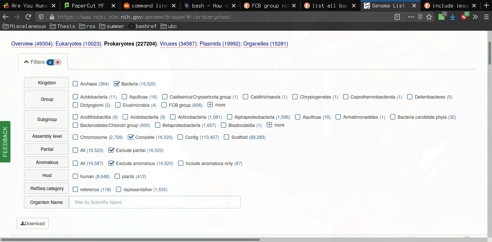

# Is Sharing Caring?
## Investigating the Relationship Between HGT Rates and CRISPR-Cas Presence Using Network Analysis

### Intro
This repository contains all of the code used to generate the figures and results for the paper.

### Methods

#### Fetching The Data

#### Markophylo Rate Inference

#### Constructing A Network

#### Network Analysis

### Pipeline
Scripts/snippets I ran to generate the data.
Also need to download the following files first
 - A summary file (tsv) containing all bacterial strain information and associated ftp urls from this [NCBI web portal](ftp://ftp.ncbi.nlm.nih.gov/genomes/browse) on Jan 29 2020
   - usIng the web portal portal i filtered the results as following
     - Kindgom: Bactreria
     - Assembly level: Complete
     - Partial: Exclude partial (althoug nothing was excluded)
     - Anomolous: Exclude anomolous (~60 were excluded)
     - all columns were included
     - see 
 - Information listing entries in the CRISPROne database to scrape [here](https://omics.informatics.indiana.edu/CRISPRone/genome.php) downloaded on Jan 27 2020
   - I downloaded the result of an empty search for all complete genomes as an html page

#### Dependencies
 - bash v4.1.2 <= was used to write all shell scripts
 - python3 ? <=
   - use conda to install packages with file thesis.yml
 - R 3.4 ? <=
   - use conda to install packages with file thesis.yml
 - diamond
 - mmseq2
 - HiDe
   - language it was written in
 - bpipe

#### Bpipe Instructions

- use bpipe to manage running everything
- seperate pipelines for
  - scraping the genomic and CRISPR annotation data
  - creating the HGT networks with HiDe
  - running markophylo to estimate indel rates
  - creating figures for the paper

